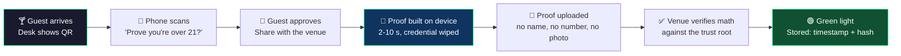
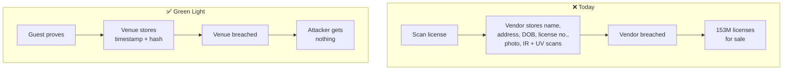

# Green Light

**Zero-knowledge proof of a US driver's license, generated on the guest's phone, accepted by any venue.** The venue learns "over 21, license valid, issued by a real DMV." Nothing else.

Apache-2.0. Personal project, not affiliated with any organization. Built with heavy use of AI.

---

## Why I built this

On September 1, 2026, a dark web service began selling scans of more than 153 million US and Canadian driver's licenses — front, back, infrared, ultraviolet — allegedly harvested from an identity verification vendor used by rental counters, dispensaries, and corporate lobbies. Timestamps matched the moments people handed over their ID. The FBI opened an inquiry. The service went dark. The licenses are still out there.

The breach is not the failure. The architecture is. Every venue that scans a license builds a copy of a government identity database it cannot defend. A bar does not need your license number to pour you a beer. It needs one bit: yes or no.

Three things follow:

1. **Collection is the vulnerability.** Data never captured cannot be sold. Encryption and retention policies assume the copy exists. This removes the copy.
2. **Nothing here is invented.** State-issued mDLs, ISO 18013-5, and zero-knowledge proof systems ship today. This is assembly, not research.
3. **The credential belongs to the person.** The proof is generated on their phone. The venue verifies math, not documents.

A bouncer checking your ID through a keyhole: he sees the answer, never the card.

---

## Status

> **Not production-ready. Do not put this in front of real guests.**

What runs today is a demo you can execute in five minutes. A real longfellow-zk proof is generated in the phone's browser from a test credential issued by a test DMV, verified by the venue service, and the venue database stores a timestamp and a proof hash — nothing else. CI runs the tests, the artifact hash check, the reproducible page build, and the Docker image on every push.

What is simulated is the wallet. A state-issued mDL from Apple or Google Wallet requires a registered relying party, so the page ships a test wallet holding a test credential.

What does not exist: security review, threat model, key management, revocation handling, legal sign-off, operator. See [MVP now, production later](#mvp-now-production-later) for the three blockers, none of which are engineering.

Judge the cryptography and the standards conformance, not who typed it.

**See it without installing anything:** [interactive walkthrough](https://claude.ai/code/artifact/c9ee1a2c-687a-4364-84d0-a1cd5aee2610) — a fictional, simulated front end of the desk screen and the guest's phone, built from this prototype's real copy and timing. Useful for partner and venue conversations; not a substitute for `make demo`.

---

## What the guest experiences



Everything else in the credential — name, address, license number, photo, height, organ donor status — stays on the device and is never transmitted.

### What changes



The venue database is deliberately boring. A row in `data/proofs.jsonl` looks like this:

```json
{"timestamp":"2026-09-02T22:14:07Z","proof_hash":"8f3ac1..."}
```

There is nothing in it worth stealing. That is the entire point.

---

## Test it in five minutes

Needs Node 24 (22 works) and openssl. No Rust, no Docker, no phone required; a phone on the same Wi-Fi makes it real.

```bash
git clone <this repo> && cd upgraded-broccoli-zkid
make demo
```

1. Open the printed **desk URL** (`http://<your LAN IP>:8080/`) on the laptop. That is the venue's desk screen: a QR that renews every 60 seconds.
2. **Phone:** scan the QR with the camera. The prover page opens, shows what the venue will and will not learn, and offers a simulated wallet sheet.
   **No phone:** click the link under the QR to open the prover page in another tab.
3. Tap **Share with the venue**, then **Continue**. The page signs the session with the credential's device key, runs Google's longfellow-zk prover in WebAssembly on the phone (2 to 10 s depending on the phone), uploads the 336 KB proof, and wipes the credential.
4. The desk goes **green** within a second of the proof arriving. `data/proofs.jsonl` gains one line.

Try the failure paths: wait past 60 s before tapping Continue (red, session expired); reload the phone page and share again on the same QR (red, session used).

Level 1, the same flow with the proof stubbed, is `make demo1`. Docker: `cd deploy && docker compose up --build`, then open port 80; set `SITE_ADDRESS=your.domain` for TLS.

---

## What is real and what is not

| Piece | Prototype | Note |
|---|---|---|
| Session nonce, QR, 60 s single-use, push to desk, hash-only storage | real | Server-Sent Events carry the result; see `docs/TEST-PLAN.md` A8 |
| Zero-knowledge proof | real | Google longfellow-zk, Rust port, commit in `packages/circuits/LONGFELLOW_COMMIT`, current circuit version 8, one attribute |
| Proof made on the guest's device | real | WebAssembly in a Web Worker; the credential never leaves the page |
| Statement proven | real | `age_over_21 = true` in an MSO whose issuer signature verifies under the issuer key, whose validity window contains the verifier's date, and whose device key signed this session's transcript |
| Issuer is a DMV on the trust list | real, in the clear | The page sends the document-signer certificate with the proof; the service checks it chains to an IACA in the Merkle root. The venue learns which issuer. In-circuit membership is M4 (ADR-0006) |
| Credential | test | Issued by the test DMV in `fixtures/`; a real mDL needs AAMVA trust-list access and a relying-party registration |
| Wallet hand-off | simulated | The Digital Credentials API request shape exists (`packages/prover-page/src/request.js`); the OS wallet sheet is a page element |
| `expiry_date` | not proven | The circuit checks the MSO validity window; disclosing `expiry_date` itself would leak a value, so it is not requested |

---

## MVP now, production later

What you can see today: real proof, real verify logic, real hash-only storage, one command to run it. Three things stand between this and production, none of them engineering:

1. **Trust list.** The venue trusts a real DMV, not a test one. Needs AAMVA VICAL access or a DMV publishing its own root — not something this team is pursuing (ADR-0009). The demo's trust list is synthetic, permanently, not "not yet real."
2. **Wallet.** The credential comes from Apple or Google Wallet, not a test wallet baked into the page. Needs a registered relying party with each vendor.
3. **Legal sign-off.** A law firm confirms a ZK proof satisfies the age-verification statute in whatever state runs the pilot. Not started.

Everything else — the proof, the verifier, the circuit, the deployment — already works.

---

## Threat model, stated honestly

**What this protects against:** bulk theft of identity documents from venues and their verification vendors. If there is no document to steal, the listing has nothing to list.

**What this does not protect against:** a compromised phone, a malicious wallet, a DMV issuing key that leaks, correlation of a guest across venues if proof hashes are shared, or a venue that photographs the guest anyway. Several have known mitigations in the literature. None are implemented here.

**What is unresolved:** revocation. If a license is suspended, this design does not yet learn about it. The issuer is also disclosed in the clear today — in-circuit trust-list membership is M4.

---

## Standards

Nothing proprietary. Nothing new.

| Piece | Standard |
|---|---|
| Credential format | ISO/IEC 18013-5 mobile driving licence (mDL) |
| Wallet hand-off | W3C Digital Credentials API |
| Proof system | Google longfellow-zk |
| Encoding | CBOR / COSE |
| Trust list | AAMVA VICAL (synthetic in this build) |

---

## How one check works

```mermaid
sequenceDiagram
  participant Desk as Desk screen
  participant Verify as Verify service
  participant Page as Prover page (phone)
  participant Wallet as Test wallet (in page)
  Verify->>Desk: 1 session {nonce, now}, QR
  Page->>Verify: 2 GET /session/nonce -> now
  Page->>Wallet: 3 share age_over_21
  Wallet->>Page: 4 IssuerSigned + device key
  Page->>Page: 5 sign SessionTranscript(nonce), assemble DeviceResponse
  Page->>Page: 6 longfellow prove (wasm, 2-10 s), wipe
  Page->>Verify: 7 proof + document-signer cert
  Verify->>Verify: 8 cert chains to IACA in Merkle root; longfellow verify(proof, pk, transcript(nonce), age_over_21, now)
  Verify->>Desk: 9 green / red (SSE)
  Verify->>Verify: 10 append {timestamp, proof_hash}
```

---

## Numbers from this build

Measured on the cloud sandbox (4 vCPU, slow) and headless Chromium 141; a laptop is roughly 2 to 4 times faster. Device numbers (C1 to C6) still need the iPhone 13 and Pixel 6.

| Step | Time |
|---|---|
| Prove, native Rust (1 attribute) | 4.7 s |
| Prove, wasm in Node | 8.5 s |
| Prove, wasm in headless Chromium | 7.9 s |
| Verify, wasm in Node (the verify service) | 3.8 to 4.3 s |
| Circuit generation, native (done once, committed) | 37 s |
| Proof size | 336 KB |
| longfellow.wasm / circuit-1.zst | 2.6 MB / 300 KB |

---

## Documents

- [SPEC.md](SPEC.md) — spec v3, the source of truth
- [docs/PLAN.md](docs/PLAN.md) — milestones M0 to M9, dates, gates, risk register
- [docs/DOD.md](docs/DOD.md) — definition of done, global and per milestone
- [docs/TEST-PLAN.md](docs/TEST-PLAN.md) — test groups A to G and pilot metrics
- [docs/CLOUD-EXECUTION.md](docs/CLOUD-EXECUTION.md) — what runs in a cloud sandbox, in Actions, or only on a phone
- [docs/SIMPLICITY.md](docs/SIMPLICITY.md) — the one rule and the budgets CI enforces
- [docs/components/](docs/components/README.md) — verified notes on every component we assemble
- [docs/SPEC-NOTES.md](docs/SPEC-NOTES.md) — where spec v3 disagrees with the evidence
- [docs/PARTNERS.md](docs/PARTNERS.md) — the eight partner asks
- [docs/adr](docs/adr) — decisions

---

## Layout

```
packages/verify-service   session nonce, proof intake, longfellow verifier (wasm), trust-root check, SSE push, hash-only store  (us)
packages/desk-screen      static QR + green/red page                                                                            (us)
packages/prover-page      static page: test wallet sheet, longfellow prover in a worker, proof upload, wipe                     (us)
packages/trust-list       certs dir (synthetic VICAL) -> Merkle root + inclusion proofs; HTTPS/ERC-7812 publisher is M5        (us)
packages/circuits         longfellow-zk pin, C-ABI wasm wrapper crate, committed artifacts (longfellow.wasm, circuit-1.zst)      (wrapper is us)
deploy/                   Dockerfile + compose + Caddy
fixtures/                 test DMV IACA + DS certs, signed test mDL with its device key, trust root (all test, regenerable)
bench/                    Node/wasm bench leg; device legs need the phones
scripts/                  fixture generation (openssl + Node), simplicity and PII checks, toolchain setup
```

---

## Rebuilding the prover

`packages/circuits/artifacts` is committed so the demo needs Node only. To rebuild from the pinned longfellow-zk commit: `bash scripts/setup-toolchain.sh && make wasm` (Rust stable, wasm32 target, about three minutes). The weekly `longfellow-wasm` workflow does the same on a GitHub runner and reports whether the wasm is byte-identical.

## Building from the cloud

Everything in this repository runs in a Claude Code cloud session: `make setup`, `make fixtures`, `make test`, `make check`, `make wasm`, a headless-Chromium run of the whole flow, and the Docker image (start `dockerd` in the background first; inside the sandbox, npm in the image build needs the proxy's CA, which is a sandbox quirk, not a Dockerfile change). Anything that touches a real wallet, a phone's timing or memory, or a browser heap on a phone needs the two physical devices.

---

## Contributing

A personal project, not a product. The most useful contributions, in order:

1. Tell me where the cryptography is wrong.
2. Tell me where the standards conformance is wrong.
3. Replace the simulated wallet with a real relying-party integration.
4. Design the revocation story.

Open an issue, or fork it and go further.

## License

Apache-2.0. See [LICENSE](LICENSE).
