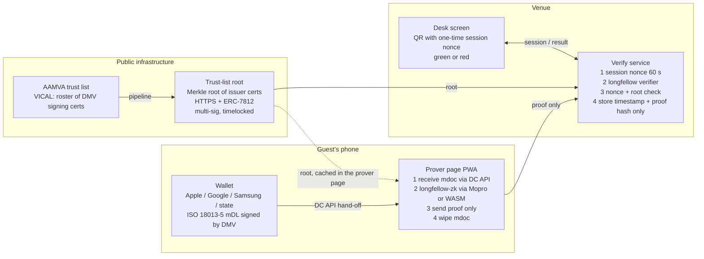
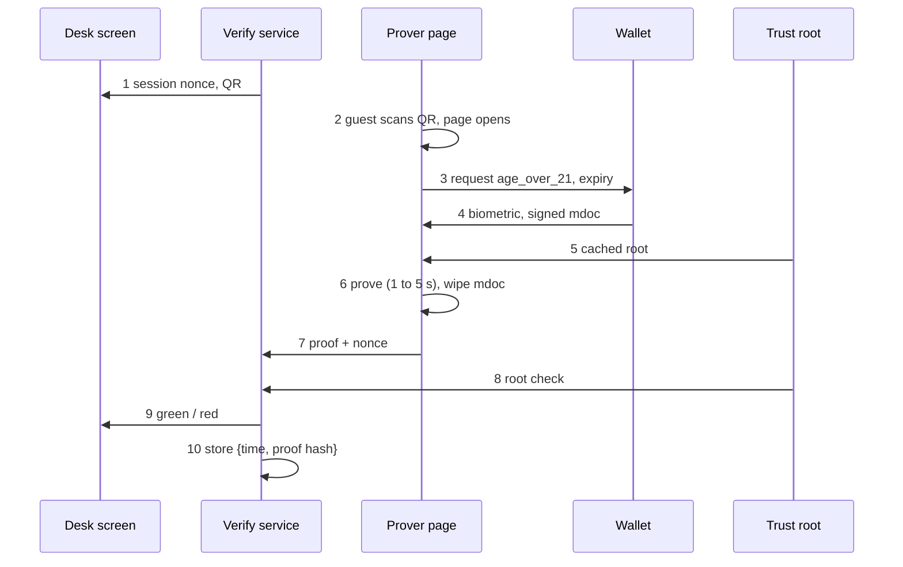

# Green Light

Zero-knowledge proof of a US driver's license, generated on the guest's phone, accepted by any venue. A venue learns "over 21, license valid, issued by a real DMV" and nothing else. Apache-2.0.

- [SPEC.md](SPEC.md) — spec v3, the source of truth
- [docs/PLAN.md](docs/PLAN.md) — milestones M0 to M9, dates, gates, risk register
- [docs/DOD.md](docs/DOD.md) — definition of done, global and per milestone
- [docs/TEST-PLAN.md](docs/TEST-PLAN.md) — test groups A to G and pilot metrics
- [docs/PARTNERS.md](docs/PARTNERS.md) — the eight partner asks
- [docs/adr](docs/adr) — decisions

## Layout

```
packages/verify-service   session nonce, proof intake, longfellow verifier hook, websocket, hash-only storage  (us)
packages/desk-screen      static QR + green/red page                                                            (us)
packages/prover-page      PWA: DC API request, longfellow via Mopro/WASM, proof upload, wipe                    (us, glue)
packages/trust-list       VICAL -> Merkle root, HTTPS publisher, ERC-7812 publisher                             (us)
packages/circuits         longfellow-zk pin + the two circuit additions                                         (fork/PR)
deploy/                   Docker one-liner
fixtures/                 test DMV cert, key, test mDL (generated, never a real credential)
bench/                    M1 device benchmark harness and report
scripts/                  fixture generation, reproducible-build check
```

## Figure 1 — system architecture



Solid arrows carry data during a check. Dashed: fetched once, cached.

## Figure 2 — one check, end to end



The wallet never talks to the venue. The venue never sees the mdoc. The root is public.

## Figure 3 — what we assemble

See the bill of materials in [SPEC.md section 2](SPEC.md). Nine rows, two are ours (verify service + desk, deployment + audit). The circuit is reuse plus extend; the standards row is co-author; everything else is reuse.

## Toolchain

| Tool | Needed for | Present on this machine |
|---|---|---|
| Node 24 | verify service, desk screen, prover page, trust list | yes |
| Python 3.11 | fixture scripts | yes |
| Rust stable + wasm-pack | longfellow build, Mopro, WASM (M1) | no |
| Xcode + Android SDK | Mopro native (M1) | no |
| Docker | reference deployment (M7) | no |
| openssl | test DMV cert | yes (macOS) |

## Quick start

```bash
make setup      # npm install in each package
make fixtures   # test DMV cert + key + test mDL into fixtures/
make test       # unit tests, all packages
make demo1      # level 1 demo: verify service + desk screen, stubbed proof
```

## Demo levels

Every screen shows which level is running.

- Level 1 — flow. Session, QR, verify service, hash-only storage are real. Proof is stubbed, credential is a test mDL.
- Level 2 — proof. longfellow-zk on a real iPhone and Pixel. Credential is still a test mDL.

A real state-issued mDL needs AAMVA trust-list access and a registered relying party. Neither is in hand yet.
